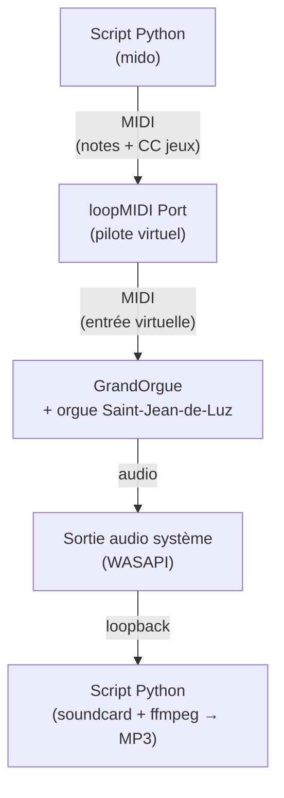
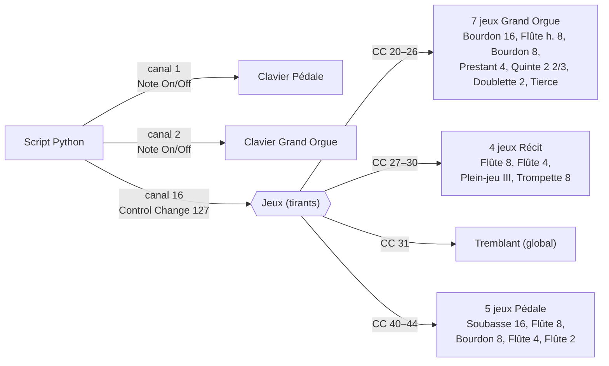

# Setup technique

Cette page documente l'architecture logicielle utilisée pour produire les enregistrements de ce site : comment un script Python pilote un orgue virtuel, quels mappings MIDI sont configurés, et comment reproduire l'ensemble.

## Architecture

Le flux complet ressemble à ceci :



Chaque composant a un rôle précis :

- **Script Python** génère des événements MIDI (notes + changements de registration)
- **loopMIDI** est un pilote virtuel qui crée un port MIDI d'un côté *Sortie*, consommé de l'autre côté comme *Entrée*
- **GrandOrgue** reçoit ces événements, joue les sons via la banque d'échantillons
- Un second script Python **capture la sortie audio** du système via WASAPI loopback, et encode en MP3

## Logiciels installés

### GrandOrgue

Sampler open-source pour orgues virtuels, équivalent gratuit de Hauptwerk.

- **Version** : 3.17.1-1
- **Téléchargement** : [grandorgue.org](https://www.grandorgue.org/) ou [GitHub Releases](https://github.com/GrandOrgue/grandorgue/releases)
- **Emplacement local** : `D:/GrandOrgue/` (application) et données utilisateur (cache, settings) au même endroit

### Orgue Saint-Jean-de-Luz (Choeur)

Banque d'échantillons libre de Piotr Grabowski enregistrée sur l'orgue de chœur de la basilique Saint-Jean-Baptiste de Saint-Jean-de-Luz.

- **Source** : [piotrgrabowski.pl](https://piotrgrabowski.pl/) — version gratuite, téléchargement via panier (0€)
- **Format** : Hauptwerk (utilisable dans GrandOrgue avec l'ODF GrandOrgue fourni à part sur la [page des versions GrandOrgue](https://piotrgrabowski.pl/grandorgue-versions/))
- **Taille** : ~7 GB compressés, ~14 GB extraits
- **Emplacement local** : `D:/OrganSamples/Saint-Jean-de-Luz (choeur).organ`

**Composition de l'instrument** :

| Division | Jeux disponibles |
|---|---|
| **Grand Orgue** | Bourdon 16, Flûte harmonique 8, Bourdon 8, Prestant 4, Quinte 2 2/3, Doublette 2, Tierce 1 3/5 |
| **Récit expressif** | Flûte 8, Flûte 4, Plein-jeu III, Trompette 8, Tremblant |
| **Pédale** | Soubasse 16, Flûte 8, Bourdon 8, Flûte 4, Flûte 2 |

L'instrument comporte également trois couplers (I/P, II/P, II/I) et dispose de trois canaux audio (front, rear, dry) pour la spatialisation.

### loopMIDI

Pilote qui crée des ports MIDI virtuels sur Windows. Gratuit.

- **Source** : [tobias-erichsen.de/software/loopmidi.html](https://www.tobias-erichsen.de/software/loopmidi.html)
- **Version utilisée** : 1.0.16.27
- **Port créé** : `loopMIDI Port` (apparaît sous le nom `loopMIDI Port 0` en entrée et `loopMIDI Port 1` en sortie dans certains logiciels)

**Attention Windows 11** : sur Windows 11 24H2 et ultérieurs, le nouveau service Windows MIDI Service peut masquer les ports loopMIDI. Si les ports ne sont pas visibles, redémarrer le service :

```powershell
Restart-Service -Name midisrv -Force
```

Cela force la ré-énumération des ports MIDI au niveau du système.

### Python 3 + mido

Librairie MIDI pour Python. Installation :

```bash
pip install mido python-rtmidi soundcard soundfile
```

## Configuration MIDI de GrandOrgue

Une fois l'orgue chargé dans GrandOrgue, il faut **apprendre** à chaque clavier et à chaque jeu un événement MIDI spécifique (fonction "MIDI Learn"). Voici les mappings configurés pour ce projet.

Vue d'ensemble du routing MIDI :



### Claviers (Note On / Note Off)

| Division | Canal MIDI | Index mido (channel=) |
|---|---|---|
| Grand Orgue | 2 | 1 |
| Pédale | 1 | 0 |
| Récit expressif | (non mappé) | — |

Le Récit n'est pas mappé au niveau clavier car les exemples pédagogiques n'en ont pas besoin, mais ses **jeux** le sont et peuvent servir à colorer la sonorité via les couplers.

### Jeux (Control Change sur canal MIDI 16 = index 15)

Tous les tirants ont été MIDI-learned en envoyant un **Control Change** de valeur **127** sur le **canal 16**. En conséquence, chaque envoi d'un CC identifié (toujours avec valeur 127) **bascule** l'état du jeu entre ON et OFF.

| CC | Jeu | Division |
|---|---|---|
| 20 | Bourdon 16 | Grand Orgue |
| 21 | Flûte harmonique 8 | Grand Orgue |
| 22 | Bourdon 8 | Grand Orgue |
| 23 | Prestant 4 | Grand Orgue |
| 24 | Quinte 2 2/3 | Grand Orgue |
| 25 | Doublette 2 | Grand Orgue |
| 26 | Tierce 1 3/5 | Grand Orgue |
| 27 | Flûte 8 | Récit |
| 28 | Flûte 4 | Récit |
| 29 | Plein-jeu III | Récit |
| 30 | Trompette 8 | Récit |
| 31 | Tremblant | (global) |
| 40 | Soubasse 16 | Pédale |
| 41 | Flûte 8 | Pédale |
| 42 | Bourdon 8 | Pédale |
| 43 | Flûte 4 | Pédale |
| 44 | Flûte 2 | Pédale |

Les numéros CC 32 à 39 sont sautés pour éviter les collisions avec des CC standards MIDI (Bank Select LSB notamment).

### Sauvegarde de la configuration

GrandOrgue sauvegarde automatiquement les MIDI-learn dans un fichier `.cmb` au chemin :

```
D:/GrandOrgue/Data/<hash-de-l-orgue>.cmb
```

Un backup manuel est recommandé : copier ce fichier ailleurs pour pouvoir restaurer rapidement en cas de besoin.

## Scripts Python

Les scripts sont dans le dossier [`/scripts`](https://github.com/ffdumont/chorals-orgue/tree/main/scripts) du repo :

### `stops_control.py`

Module réutilisable qui définit la table `CC_STOPS` (mapping nom → numéro de CC) et la classe `Stops` pour basculer les jeux. Expose aussi des presets (`doux`, `fonde`, `plein_jeu`).

### `play_midi.py`

Joueur simple d'un fichier MIDI. Optionnellement tire une registration prédéfinie avant la lecture :

```bash
python play_midi.py chorale.mid --stops doux
```

### `humanize.py`

Applique un jitter d'attaque et une articulation légère à un fichier MIDI pour éviter l'effet mécanique :

```bash
python humanize.py source.mid sortie.mid --jitter 10 --articulation 0.08
```

### `demo_registration.py`

Improvisation en 5 phases qui illustre le pilotage dynamique des jeux pendant la musique.

### `record_all.py`

Pipeline complet qui enregistre tous les exemples du site en MP3. Pour chaque pièce :

1. Tire les jeux via MIDI CC
2. Démarre la capture audio WASAPI loopback (via `soundcard`)
3. Envoie le MIDI à GrandOrgue
4. Arrête la capture, sauve en WAV
5. Convertit en MP3 via ffmpeg (qualité VBR ~190 kbps)
6. Passe à la pièce suivante

Le résultat : 5 fichiers MP3 dans `assets/audio/` produits sans aucune intervention manuelle.

## Génération des partitions PNG

Les partitions affichées dans les pages de pièces sont générées depuis les fichiers MIDI via MuseScore 4 en ligne de commande :

```bash
"C:/Program Files/MuseScore 4/bin/MuseScore4.exe" fichier.mid -o fichier.png -T 10
```

L'option **`-T 10`** recadre automatiquement le PNG au contenu musical avec une marge de 10 pixels. Sans elle, MuseScore exporte la page A4 entière (la musique n'occupe qu'un quart en haut, tout le reste est blanc), ce qui produit un gros vide sous la partition dans le wiki.

MuseScore génère un fichier par page en suffixant `-1`, `-2`, etc. au nom de sortie — pour les exemples courts de ce site, seule la page 1 existe (`exemple1-1.png`).

## Reproductibilité

Pour répliquer ce setup sur une machine Windows :

1. **Installer les logiciels** :
   - GrandOrgue (lien ci-dessus)
   - loopMIDI (créer un port `loopMIDI Port`)
   - Python 3.10+ avec `pip install mido python-rtmidi soundcard soundfile`
   - ffmpeg (pour l'encodage MP3, optionnel si on ne fait que jouer)

2. **Télécharger et extraire** la banque Saint-Jean-de-Luz Choeur depuis piotrgrabowski.pl (le fichier audio de 7 GB + l'ODF GrandOrgue).

3. **Charger l'orgue** dans GrandOrgue (File > Load organ), choisir 16 bit / 2 canaux pour économiser la RAM.

4. **Configurer les MIDI-learn** :
   - Clic droit sur chaque clavier virtuel → MIDI → "Attendre évènement MIDI" → envoyer une note sur le canal voulu
   - Clic droit sur chaque tirant de jeu → MIDI → idem avec le CC voulu

5. **Sauvegarder** (File > Save) pour que les mappings soient persistés dans le `.cmb`.

6. **Cloner le repo** et exécuter les scripts :
   ```bash
   git clone https://github.com/ffdumont/chorals-orgue.git
   cd chorals-orgue/scripts
   python play_midi.py ../assets/midi/exemple4.mid --stops fonde
   ```
